# SRR to Transportability Diagram

Purpose: this is an editable conceptual diagram specification for supervisor presentation. It is intentionally simple and text-first; it should be rendered as Mermaid or redrawn manually in slides, not converted into a decorative illustration.

## Diagram

```mermaid
flowchart LR
    accTitle: SRR To Transportability
    accDescr: The diagram shows how CARE moved from representation retrieval as selective cross-source integration to the newer pathology-preserving transportability question.

    rrl["Representation Retrieval Learning<br/>source heterogeneity<br/>representation dictionary idea"]
    selective["Selective cross-source integration<br/>share useful structure<br/>keep source or modality differences visible"]
    care_srr["CARE SRR attempt<br/>multi-centre CMR<br/>missing LGE/T2/C0 patterns<br/>scar and edema supervision"]
    pathology["Dense pathology complexity<br/>small scar<br/>diffuse edema<br/>remote false positives<br/>no-T2 safety"]
    lesson["Realization<br/>not all shared information is benign<br/>integration can erase pathology"]
    transport["Pathology-preserving transportability<br/>ask when integration helps<br/>and when it removes clinically meaningful signal"]

    rrl --> selective --> care_srr --> pathology --> lesson --> transport

    classDef source fill:#eef2ff,stroke:#4f46e5,color:#111827
    classDef care fill:#ecfdf5,stroke:#059669,color:#111827
    classDef risk fill:#fff7ed,stroke:#ea580c,color:#111827
    classDef target fill:#f0f9ff,stroke:#0284c7,color:#111827

    class rrl,selective source
    class care_srr care
    class pathology,lesson risk
    class transport target
```

## Slide Notes

| Segment | Speaker note |
|---|---|
| Representation Retrieval Learning | Treat as the historical statistical motivation. Do not present paper-level details unless the exact source PDF is available. |
| Selective cross-source integration | The attractive CARE idea was selective sharing under centre and modality heterogeneity. |
| CARE SRR attempt | CARE translated the idea into availability-aware routing, shared/private retrieval, pathology heads, no-T2 safety, and final-output audits. |
| Local pathology complexity | Dense segmentation made the method responsible for morphology, boundary closure, connected components, and remote false-positive control. |
| Not all shared information is benign | This is the scientific lesson: shared features can help generalization, but they can also wash out rare or clinically meaningful lesion signals. |
| Pathology-preserving transportability | The current research question is not just cross-source integration, but deciding when integration preserves pathology across source shifts. |

## Editing Guidance

- Keep the diagram left-to-right for presentation readability.
- If space is tight, merge the first two nodes into `RRL: selective representation sharing`.
- Do not add architecture boxes for old SRR modules unless the slide is specifically about implementation history.
- Use this as a conceptual transition slide, not as an experimental results slide.
