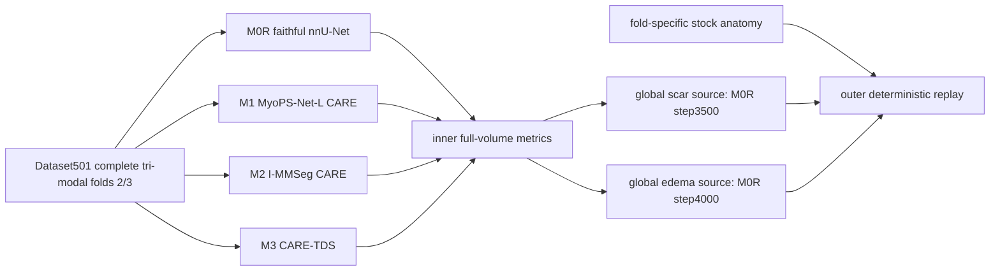

# Mapper Report Final

当前实现已经从旧 W0 blocked 状态进入完整四 lane 训练和评价闭环。Mapper 结论：本轮可确认 M0R/M1/M2/M3 均有真实训练产物和 inner full-volume 评价；最终 source freeze 没有使用 outer；outer replay 使用冻结 source 做确定性复放。

## Evidence Map

| component | evidence |
|---|---|
| frozen split/data contract | `frozen_data_contract.json`, `split_receipt_copy.json`, `fold2_fold3_case_manifest.csv` |
| M0R faithful control | `m0r_faithful_control/fold2_training_receipt.json`, `m0r_faithful_control/fold3_training_receipt.json`, `checkpoint_reload_audit.json` |
| M1 MyoPS-Net-L CARE | `m1_myopsnet_l_care/fold2_training_receipt.json`, `m1_myopsnet_l_care/fold3_training_receipt.json` |
| M2 I-MMSeg CARE | `m2_i_mmseg_care/asset_download_receipt.json`, `released_checkpoint_smoke_receipt.json`, `adapter_preflight_report.json`, fold receipts |
| M3 CARE-TDS | `m3_care_tds/fold2_training_receipt.json`, `m3_care_tds/fold3_training_receipt.json` |
| inner full-volume evaluation | `inner_evaluation/*/casewise_metrics.csv`, `inner_evaluation/*/global_summary_metrics.csv` |
| source freeze | `inner_evaluation/global_source_selection.json` |
| outer deterministic replay | `outer_replay/outer_replay_receipt.json`, `outer_replay/summary_metrics.csv`, `outer_replay/sentinel_case_atlas.md` |

## Dataflow

## Boundary

- M0R won both frozen sources, but this does not authorize official validation or Docker upload.
- M2 used official source/assets and was not replaced by a lite surrogate.
- M3 produced very weak pathology output on inner evaluation; it is retained as evaluated evidence, not hidden.
- Final scientific token is `SCAR_ONLY_CANDIDATE_READY`, because edema is still unreliable on CenterC sentinel cases.
