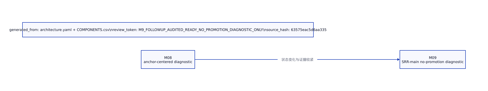

# M8 与 M9 简明对比

| 组件 | M8 判断 | M9 判断 | delta |
| --- | --- | --- | --- |
| 可用性与 no-T2 安全 | anchor-centered/diagnostic | SRR-main no-promotion diagnostic | 证据要求更严格 |
| 检索字典与表示槽 | anchor-centered/diagnostic | SRR-main no-promotion diagnostic | 证据要求更严格 |
| 原型与负样本记忆 | anchor-centered/diagnostic | SRR-main no-promotion diagnostic | 证据要求更严格 |
| 解剖先验 | anchor-centered/diagnostic | SRR-main no-promotion diagnostic | 证据要求更严格 |
| 病灶 proposal | anchor-centered/diagnostic | SRR-main no-promotion diagnostic | 证据要求更严格 |
| soft-ROI refiner | anchor-centered/diagnostic | SRR-main no-promotion diagnostic | 证据要求更严格 |
| 分支仲裁与最终输出 | anchor-centered/diagnostic | SRR-main no-promotion diagnostic | 证据要求更严格 |
| loss 与优化目标 | anchor-centered/diagnostic | SRR-main no-promotion diagnostic | 证据要求更严格 |
| checkpoint 选择 | anchor-centered/diagnostic | SRR-main no-promotion diagnostic | 证据要求更严格 |
| 训练证据与指标 | anchor-centered/diagnostic | SRR-main no-promotion diagnostic | 证据要求更严格 |
| Cine temporal 分支 | anchor-centered/diagnostic | SRR-main no-promotion diagnostic | 证据要求更严格 |

